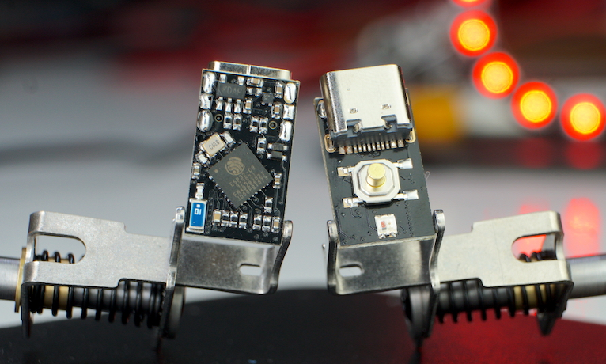
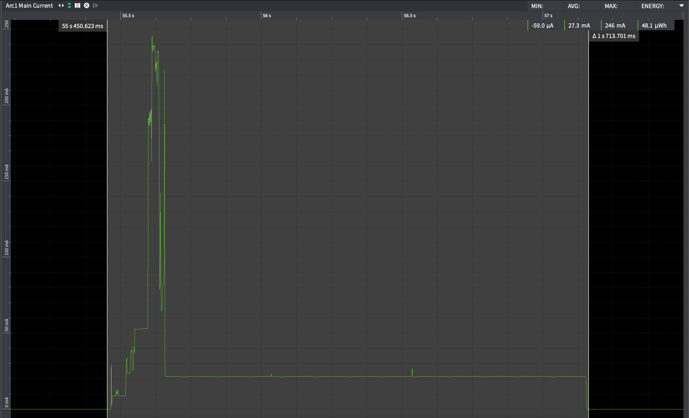
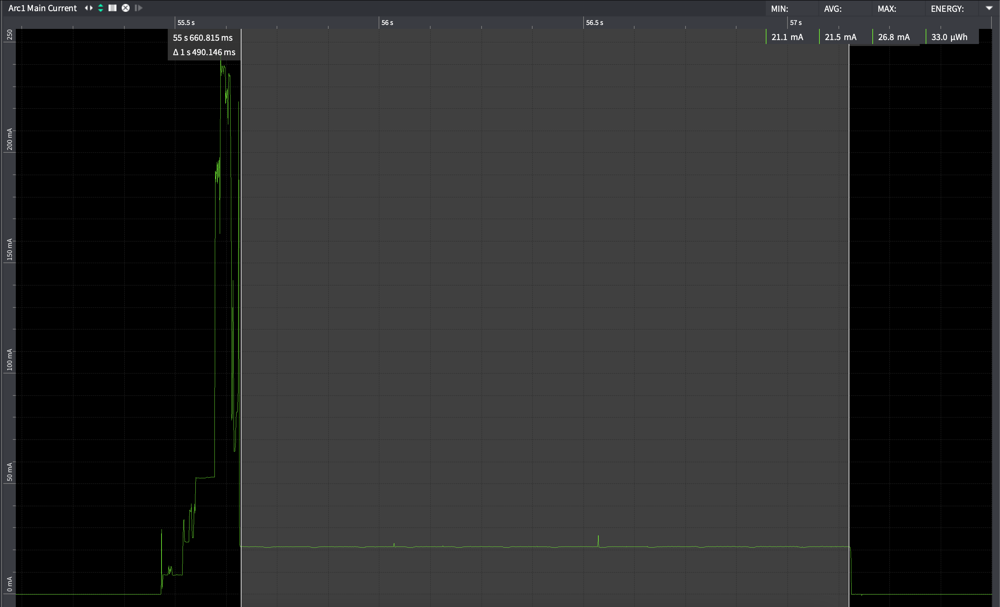
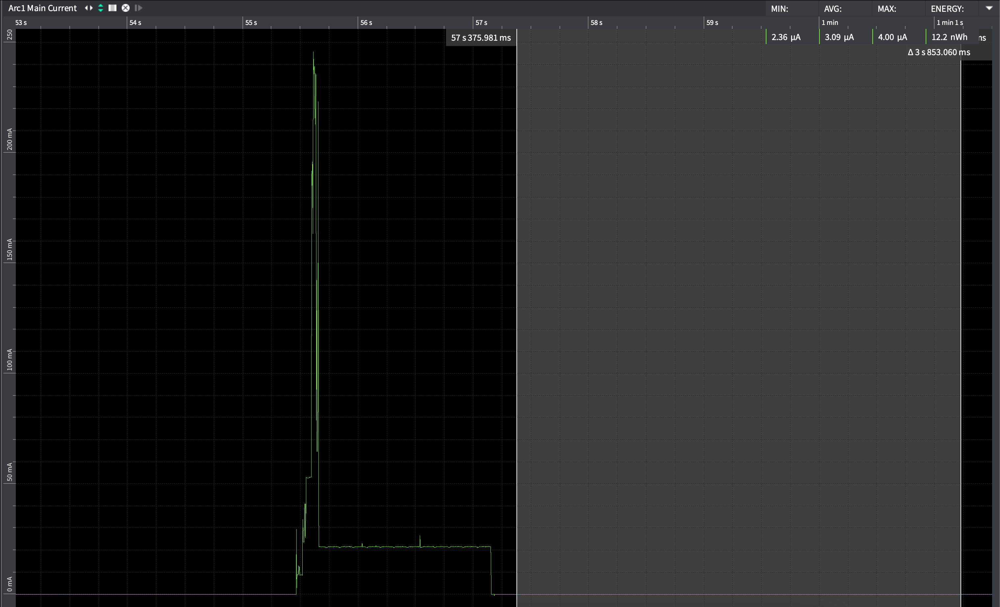
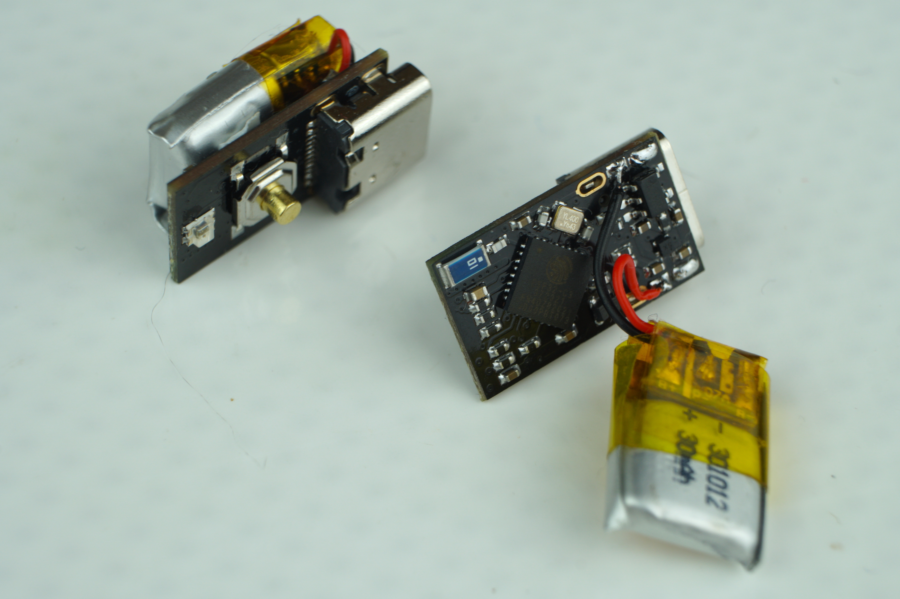

# Picoclick-C3

**This page is a work in progress!**

</a>

The Picoclick C3 as well as its little brother (the C3T, T = tiny) are the successors of the well known [Picoclick](https://github.com/makermoekoe/Picoclick). The name is related to its new processor: the [ESP32-C3](https://www.espressif.com/sites/default/files/documentation/esp32-c3_datasheet_en.pdf) single core RISC-V 160MHz CPU.

The Picoclick C3T is a tiny WiFi and BLE IoT button for several applications. Originally designed for smart home things, the Picoclick can also be used as an actuator for IFTTT automations or as an MQTT device. It is based on the single core ESP32-C3 RISC-V processor and therefore comes with tons of useful features. With dimensions of only 10.5mm by 18mm the C3T not only the smallest one in the family of the Picoclicks, it is also the smallest device I have created so far.

The [Youtube video](https://www.youtube.com/watch?v=t-50w3RsUlg) shows the assembly and soldering process, the optimization of the boot up time, the power measurements as well as some useful applications of the Picoclick.

As the C3 is in development at the moment, most of the files are related to the C3T so far.

Here are some specs of the Picoclick C3T:
- Dimensions are only 10.5x18mm
- Ultra low standby current due to latching circuit (no sleep mode needed)
- Single button & LED interface (WS2812 RGB LED)
- USB Type-C for charging the battery and flashing the ESP32-C3

## GPIOs

Function | GPIO C3T | GPIO C3 | Mode
-------- | -------- | -------- | --------
WS2812 Din | GPIO6 | GPIOX | Output
Latch* | GPIO3 | GPIOX | Output
Button | GPIO5 | GPIOX | Input
Charge Stat. | GPIO1  | GPIOX | Input
Bat Voltage | GPIO4 | GPIOX | Input

*Enabling the LDO can be done by pressing the button of the device or turning the latch high. In most use cases, the latch GPIO should be turned on as the first task of the Picoclick. Once the task is completed the device can be powered off by turning to the latch off (e.g. pulling it low).


## Speed up boot process

Due to the latching circuit, the button press has to be longer than the boot up time of the processor, because the first task should have been executed once the button is released. For most of the use cases of the Picoclick the first task is to toggle the latch GPIO high in order to enable power hold feature of the Picoclick. If this task haven't been executed before the button is released, the Picoclick is going to standby mode without finishing its main task.
Standard boot up time of the ESP32-C3 is almost 300ms. So the first task will be executed after these 300ms. This is far too long because a standard button press (especially with the metal buttons on the C3T) is around 100ms-200ms or even slightly below. Almost every task of the Picoclick would have been interrupted in this case (unless you press and hold the button...).
To speed up the boot process I got familiar with the ```menuconfig``` of the ESP-IDF. Actually the reason why I've switched from the Arduino framework to ESP-IDF was that I get access to all the configs of the ESP32-C3.

Things I have done so far:
- Set *Flash SPI mode* from *DIO* to *QIO* (in Serial flasher config)
- Set *Log output* from *Info* to *Warning* (in component config)
- Set *Bootloader log verbosity* from *Info* to *Warning* (in Bootloader config)
- Enable *Skip image validation from power on* (in Bootloader config)

These points result in a boot up time of around 68ms which is almost quite fantastic. The test I've done so far were quite sufficient. If it is possible to make it even faster or if you have other ideas which could lead into the right direction then please let me know!

## Power consumption

These power measurements are done with the Otii Arc power analyzer and its dedicated software. The average and peak current can be seen in the top right corner and is based on the selected frame in the current graph.
The Picoclick C3T is used as an ESP-NOW slave in this case, which is probably the fastest solution of any wireless connection.

A complete Picoclick task will look like this, whereby the LED part in the end is the longest part. The whole task took about 1,7 seconds, but the transmission itself is completed after around 200ms. The other part is with disabled WiFi and only used to do some visualizations with the LED. Overall average current is below 28mA.

</a>

The ESP-NOW package is sent in the first 200ms. Average current is 73mA here.

</a>

As already said, the rest is just visualization stuff which will use 22mA of current in average.

</a>

Probably the most interesting part is the standby current, because it's the most used state of the Picoclick. As the device doesn't use any sleep mode, we're getting as low as 3µA in this state. This is only related to the battery monitoring feature. As the voltage divider between ```Vbat``` and ```GND``` is ```1MOhm + 250kOhm = 1.25MOhm``` the current flow through it is about 3µA.

</a>

### Battery for the click

The optimal battery, which is shown in the picture below, is a 301012 LiPo battery (3.0mm thick, 10mm width, 12mm length). Nevertheless you can use whatever single cell LiPo battery you want. Charging current is set to 20mA, to be used with those 20-30mAh batteries. For larger capacity batteries the battery charging time will - of course - increase. For 20-30mAh charging time is about 1h - 1,5h.

Below are some links for those tiny batteries (no sponsor, no affiliate, just for info):

[Aliexpress 301012](https://de.aliexpress.com/item/1005003644834180.html)

[Aliexpress 401012](https://de.aliexpress.com/item/32794940086.html)

[eBay 301012](https://www.ebay.com/itm/333907143841)


</a>
