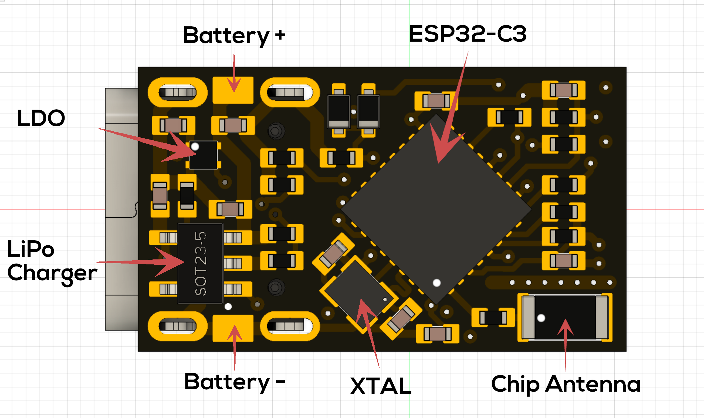
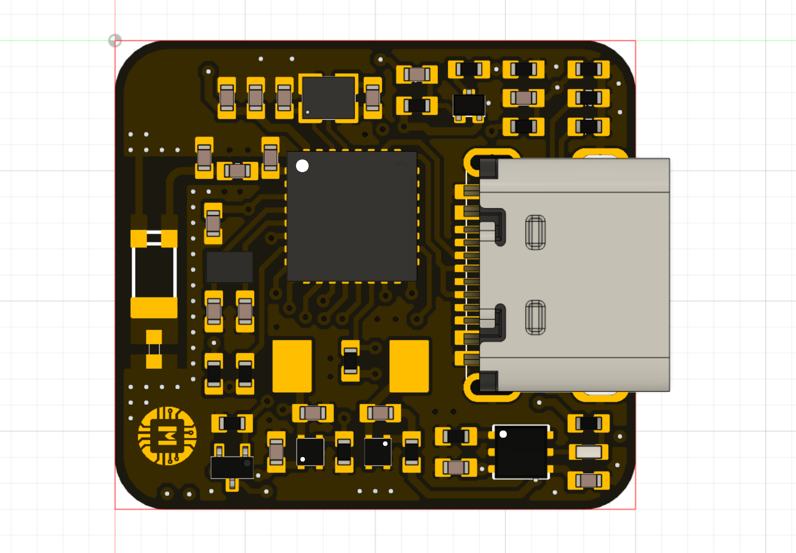
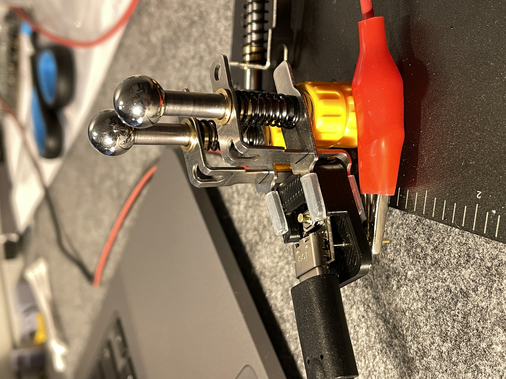
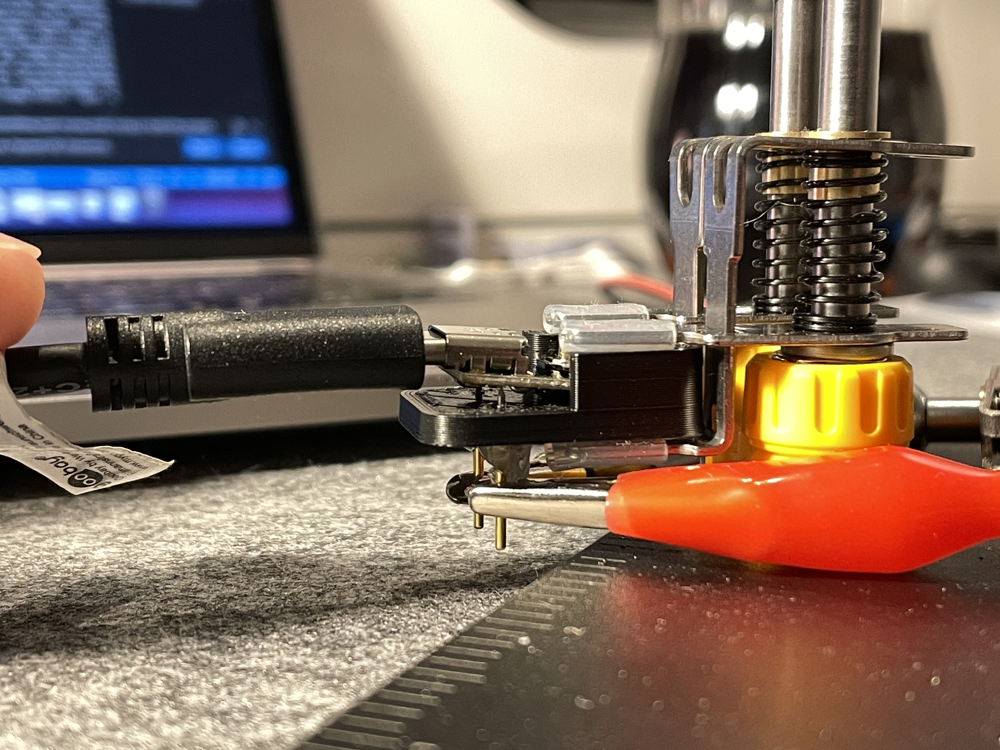
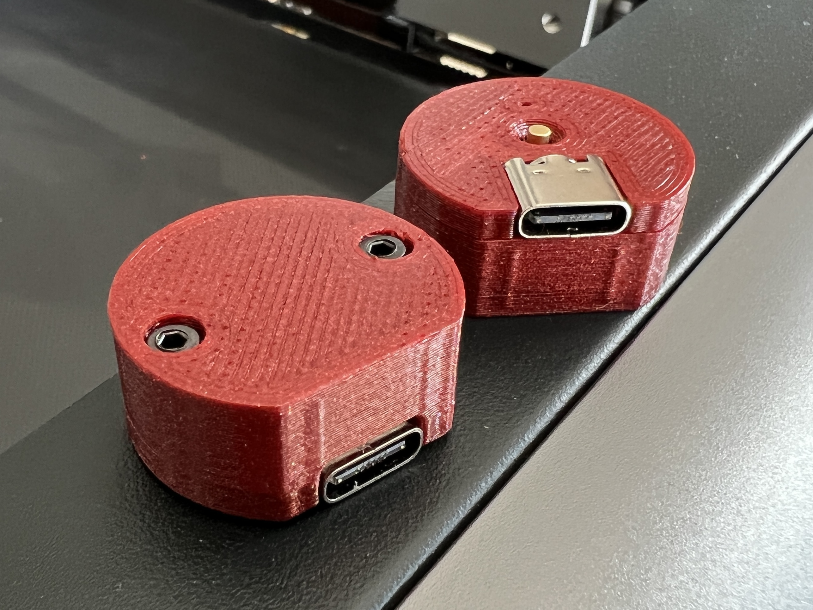

# Picoclick-C3

**This page is a work in progress!**

</a>

The Picoclick C3 as well as its little brother (the C3T, T = tiny) are the successors of the well known [Picoclick](https://github.com/makermoekoe/Picoclick). The name is related to its new processor: the [ESP32-C3](https://www.espressif.com/sites/default/files/documentation/esp32-c3_datasheet_en.pdf) single core RISC-V 160MHz CPU.

The Picoclick is a tiny WiFi and BLE IoT button for several applications. Originally designed for smart home things, the Picoclick can also be used as an actuator for IFTTT automations or as an MQTT device. It is based on the single core ESP32-C3 RISC-V processor and therefore comes with tons of useful features.
With dimensions of only 10.5mm by 18mm, the C3T is not only the smallest one in the family of the Picoclicks, it is also the smallest device I have created so far.

The [Youtube video of the C3T](https://www.youtube.com/watch?v=t-50w3RsUlg) shows the assembly and soldering process, the optimization of the boot up time, the power measurements as well as some useful applications of the Picoclick.

As the C3 is in development at the moment, most of the files are related to the C3T so far.

Here are some specs of the Picoclick C3T:
- Dimensions are only 10.5x18mm
- Ultra low standby current due to latching circuit (no sleep mode needed)
- Single button & LED interface (WS2812 RGB LED)
- USB Type-C for charging the battery and flashing the ESP32-C3

<a href="https://www.tindie.com/stores/makermoekoe/?ref=offsite_badges&utm_source=sellers_makermoekoe&utm_medium=badges&utm_campaign=badge_large"></a>


## Update 14.07.2022: The Picoclick C3 is alive!

It's a pleasure for me to announce that the Picoclick C3 (the big brother of the C3T) is finally here! It comes with the most advanced features of my latest projects which occupies the following points:

- Optimized idle current: we're below 200nA (!!) current consumption (without battery protection) in idle state! (compared to 3µA for the C3T)
- Optimized antenna design, which will lead to a better performance and longer range.
- Optimized power latching circuit, which makes the firmware development easier. (especially with the Arduino IDE)
- Optimized battery charging circuit with separated status LED.
- Added second RTC crystal for BLE applications.
- Added FPC connector for connecting external hardware.
- Added embedded battery protection.
- Added boot emergency jumper.
- Same dimensions as the standard Picoclick.
- Added a nice "golden" logo ;)

## GPIOs

Function | GPIO C3T | GPIO C3 | Mode
-------- | -------- | -------- | --------
LED | GPIO6 | GPIO6 (CLK) + GPIO7 (SDI) | Output
Latch* | GPIO3 | ** | Output
Button | GPIO5 | GPIO5 | Input
Charge Stat. | GPIO1  | ext. LED | Input
Bat Voltage | GPIO4 | GPIO4 | Input
Bat Voltage EN | -- | GPIO3 | Output

*Enabling the LDO can be done by pressing the button of the device or turning the latch high. In most use cases, the latch GPIO should be turned on as the first task of the Picoclick. Once the task is completed the device can be powered off by turning the latch off (e.g. pulling it low).

**The Picoclick C3 doesn't need a latching GPIO because it uses the embedded flash's power supply pin as a reference. It can be depowered with putting the ESP32 in deepsleep. To reduce the power consumption of the ESP32 this function will disable the power of the embedded flash (VDD_SPI) which in result will depower the Picoclick itself. The deepsleep calling function is only necessary to pulling the VDD_SPI line low, not to use the deepsleep mode of the ESP32.

### Extension port of the Picoclick C3

The C3 has an FPC extension connector which can be used to power the Picoclick via the `VBAT` pin, actuate the button press and use two pulled-up GPIOs (for I2C for example). Furthermore it leads out `+3V3` and `GND` signal.

Pinout coming soon.

#### Using I2C

Both external GPIOs are strapping pins of the ESP32C3 and thus are pulled up on the Picoclick itself (they don't need external I2C pull-ups).

Function | GPIO C3
-------- | --------
SDA | GPIO2
SCL | GPIO8

#### External button actuator

The external button pin can be used for external switches, door sensors, reed sensors and motion sensors.
The button signal (pin XX TODO) has to be tied to `VBAT` to actuate a button press.
I'm using the Picoclick as an IOT-doorbell, but here an external optocoupler is needed, because my doorbell is running on AC. (Tutorial coming soon)

## Board overview (Battery connections)

### C3T

</a>

### C3

component description following.

</a>

## Flashing firmware to the ESP32

### C3T

**- Press and hold the button during the complete flashing process! Otherwise the ESP32 will be loose power and the upload process will crash!**

**- A battery or a power supply has to be applied to the battery pads (3.5v - 5.5v) in order to flash the device!**

Except the above, the Picoclick behaves like a normal development board. No need to get the ESP32 into download mode or pressing any reset button.

### C3

As the C3 comes with an optimized power latching circuit, the button doesn't have to be pressed the whole flashing time. But to be recognized from the PC it has to be on while hitting the upload button, else the serial console is not active. Furthermore the C3 doesn't need a connected battery. If you wanna use the Picoclick over USB only, you can short the jumper marked jumper (TODO). Don't connect a battery or an external power supply to the pads if this jumper is shorted, else you would destroy your power source or the Picoclick itself.

Furthermore, as the VBAT pin is available on the FPC connector, the Picoclick C3 can be powered over the extension cable. With the FPC breakout board, the device can thus simply be powered from a breadboard.

### C3

As the C3 comes with an optimized power latching circuit, the button doesn't have to be pressed the whole flashing time. But to be recognized from the PC it has to be on while hitting the upload button, else the serial console is not active. Furthermore the C3 doesn't need a connected battery. If you wanna use the Picoclick over USB only, you can short the jumper marked with XXX (TODO) in the TODO corner. Don't connect a battery or an external power supply to the pads if this jumper is shorted, else you would destroy your power source or the Picoclick itself.

Furthermore, as the VBAT pin is available on the FPC connector, the Picoclick C3 can be powered over the extension cable. With the FPC breakout board, the device can thus simply be powered from a breadboard.

## Speed up boot process

**Following instructions are only needed for the C3T, not for the C3 as it doesn't use a separate latching GPIO.**

Due to the latching circuit, the button press has to be longer than the boot up time of the processor, because the first task should have been executed once the button is released. For most of the use cases of the Picoclick the first task is to toggle the latch GPIO high in order to enable power hold feature of the Picoclick. If this task haven't been executed before the button is released, the Picoclick is going to standby mode without finishing its main task.
Standard boot up time of the ESP32-C3 is almost 300ms. So the first task will be executed after these 300ms. This is far too long because a standard button press (especially with the metal buttons on the C3T) is around 100ms-200ms or even slightly below. Almost every task of the Picoclick would have been interrupted in this case (unless you press and hold the button...).
To speed up the boot process I got familiar with the ```menuconfig``` of the ESP-IDF. Actually the reason why I've switched from the Arduino framework to ESP-IDF was that I get access to all the configs of the ESP32-C3.

Things I have done so far:
- Set *Flash SPI mode* from *DIO* to *QIO* (in Serial flasher config)
- Set *Log output* from *Info* to *Warning* (in component config)
- Set *Bootloader log verbosity* from *Info* to *Warning* (in Bootloader config)
- Enable *Skip image validation from power on* (in Bootloader config)

These points result in a boot up time of around 68ms which is almost quite fantastic. The test I've done so far were quite sufficient. If it is possible to make it even faster or if you have other ideas which could lead into the right direction then please let me know!

## Power consumption

### C3T

These power measurements are done with the Otii Arc power analyzer and its dedicated software. The average and peak current can be seen in the top right corner and is based on the selected frame in the current graph.
The Picoclick C3T is used as an ESP-NOW slave in this case, which is probably the fastest solution of any wireless connection.

A complete Picoclick task will look like this, whereby the LED part in the end is the longest part. The whole task took about 1,7 seconds, but the transmission itself is completed after around 200ms. The other part is with disabled WiFi and only used to do some visualizations with the LED. Overall average current is below 28mA.

</a>

The ESP-NOW package is sent in the first 200ms. Average current is 73mA here.

</a>

As already said, the rest is just visualization stuff which will use 22mA of current in average.

</a>

Probably the most interesting part is the standby current, because it's the most used state of the Picoclick. As the device doesn't use any sleep mode, we're getting as low as 3µA in this state. This is only related to the battery monitoring feature. As the voltage divider between ```Vbat``` and ```GND``` is ```1MOhm + 250kOhm = 1.25MOhm``` the current flow through it is about 3µA.

</a>

### C3

coming soon.

## Battery for the Picoclick

### C3T

The optimal battery, which is shown in the picture below, is a 301012 LiPo battery (3.0mm thick, 10mm width, 12mm length). Nevertheless you can use whatever single cell LiPo battery you want. Charging current is set to 20mA, to be used with those 20-30mAh batteries. For larger capacity batteries the battery charging time will - of course - increase. For 20-30mAh charging time is about 1h - 1,5h.

Below are some links for those tiny batteries (no sponsor, no affiliate, just for info):

[Aliexpress 301012](https://de.aliexpress.com/item/1005003644834180.html)

[Aliexpress 401012](https://de.aliexpress.com/item/32794940086.html)

[eBay 301012](https://www.ebay.com/itm/333907143841)


</a>

### C3

As the Picoclick C3 comes with an embedded battery protection, the protection of the LiPo battery itself is redundant. Therefore you can use these tiny cells which are used by BT headsets. They come in a 401010 or 301010 package.

[Aliexpress 401010](https://de.aliexpress.com/item/1005004324462178.html)

## Flashing adapter with pogopins

### C3T

In order to flash boards without soldering wires or batteries to the Picoclick, I decided to print a simple flashing adapter which uses 1mm pogopins to make contact to the battery pads on the board. Just plug in the USB cable, shift the device in, press it down to the pogopins and hit the upload button. Simple overview is given below.

</a>
</a>

### C3

Needless because the Picoclick C3 can be powered over the extension cable.

## Cases

### Case 2 (round) for the C3T

Round design. Combined with two M2x8mm screws.

</a>

### Cases C3

coming soon.

# FAQ

## My Picoclick C3T is not shown on the device list when I plug it in the computer - what can I do?
- Your Picoclick is well tested before shipping, so it is probably not broken. Make sure you have connected a decent power supply to the battery connections (3.5v - 5.5v). Battery polarity is shown above. The USB-C jack is only for charging the battery and to flash the ESP32 - not for powering the device.

## Media

Hackster.io article by James Lewis: [Picoclick C3T Is the World's Smallest IoT Button and It Has a RISC-V Processor](https://www.hackster.io/news/picoclick-c3t-is-the-world-s-smallest-iot-button-and-it-has-a-risc-v-processor-7eddb2c14bda?fbclid=IwAR0fc_usR9xU9rvV6_ah3hptwWU2ObRKkqjKUgYzedlxkP4QRlh8Du6uMtc)

Electronics-lab.com article by Abhishek Jadhav: [Picoclick C3T IOT button built around ESP32-C3 RISC-V processor – supports WIFI and BLE](https://www.electronics-lab.com/picoclick-c3t-iot-button-built-around-esp32-c3-risc-v-processor-supports-wifi-and-ble/)
